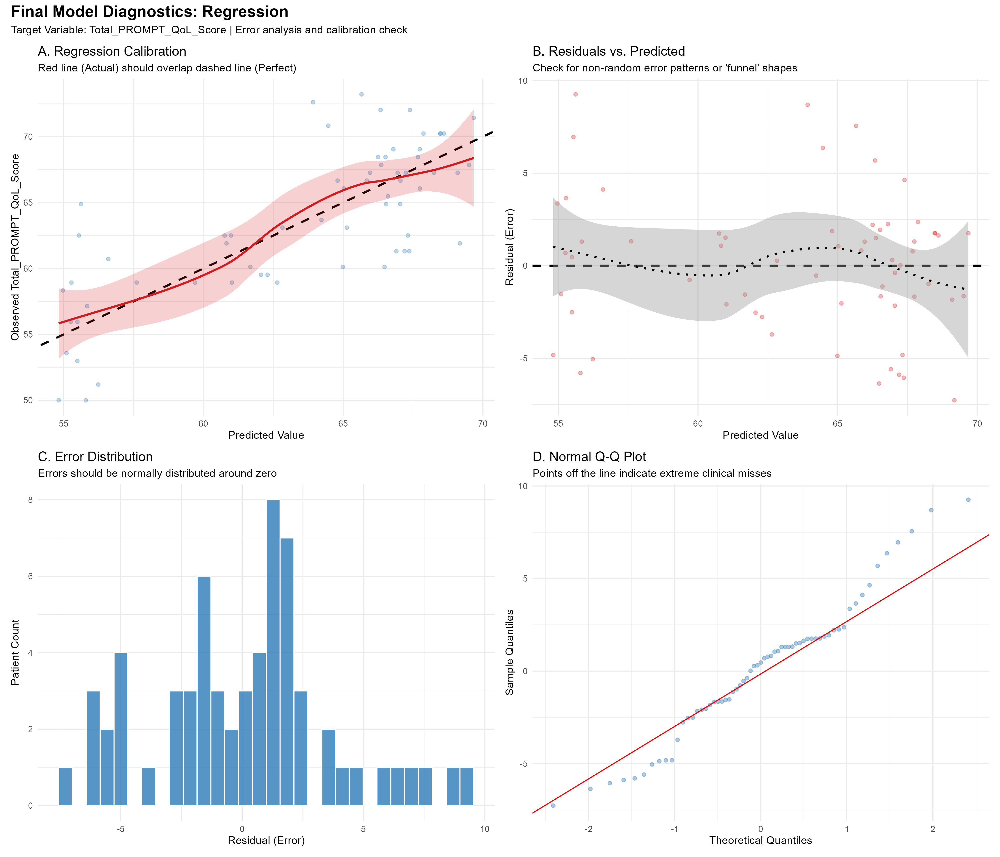
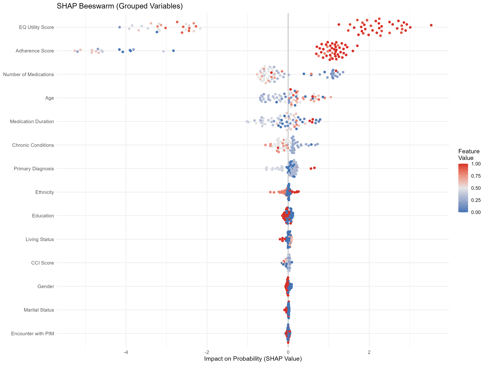
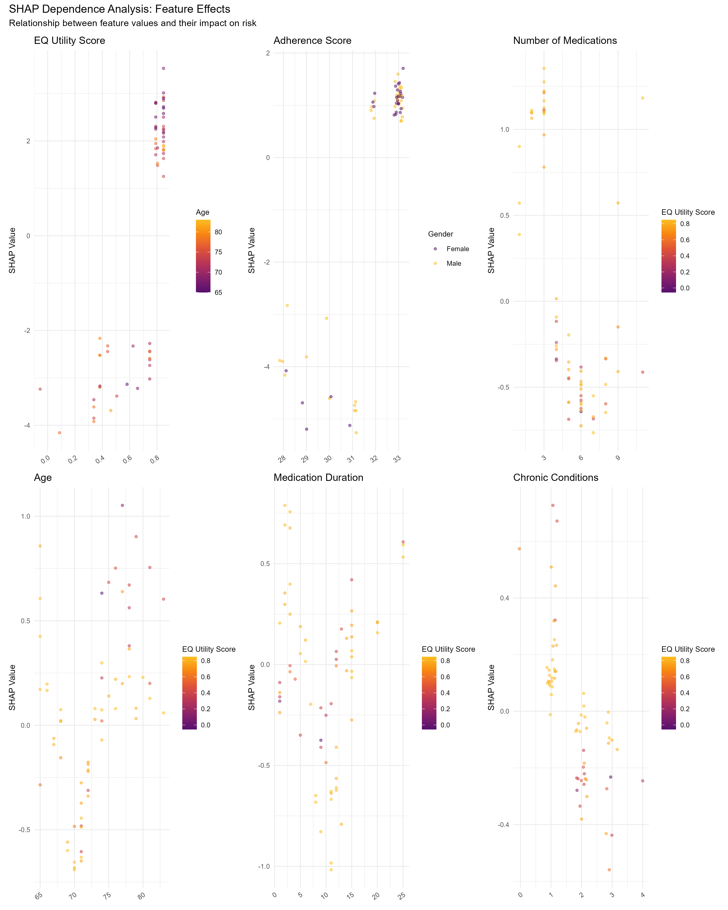
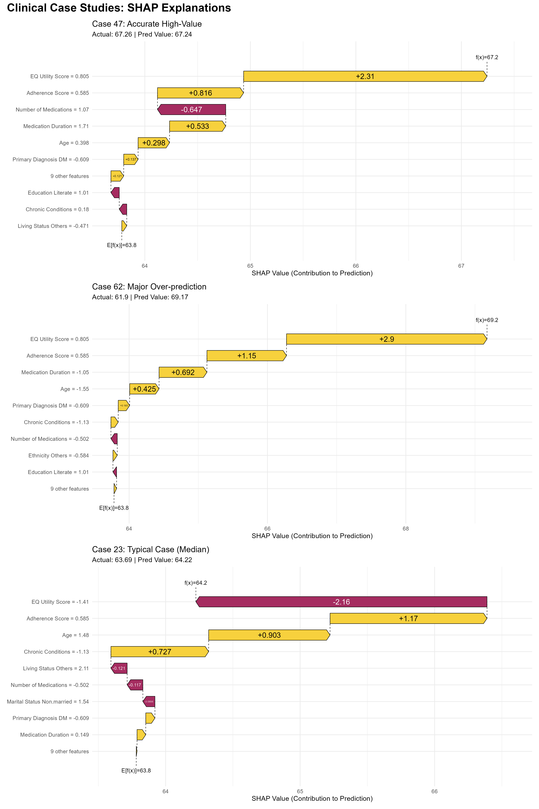

# Biomed-ML-Framework 🩺📊


An end-to-end automated machine learning framework tailored for clinical research. Built on the `tidymodels` ecosystem, this pipeline streamlines the process of training, tuning, and interpreting high-performance models while maintaining the rigorous validation standards required for medical publications.

## 🚀 Key Features

* **Multi-Engine Support**: Seamlessly switch between LightGBM, XGBoost, Random Forest (ranger), Penalized Regression (glmnet), and SVM.
* **Automated Feature Engineering**: Includes Information Gain-based selection for classification and Distance Correlation for regression tasks.
* **Hyperparameter Racing**: Utilizes ANOVA racing methods (`finetune`) to efficiently find optimal parameters without exhaustive grid searches.
* **Clinical Readiness**: 
    * **Decision Curve Analysis (DCA)** to evaluate clinical utility and net benefit.
    * **Bootstrap Confidence Intervals** (default 500 resamples) for all performance metrics.
    * **Threshold Optimization** using Youden’s J-statistic to maximize sensitivity and specificity.
* **Explainable AI (XAI)**: Advanced interpretability via model-specific importance and SHAP visualizations (beeswarm, dependence, and waterfall plots).
* **Automated Reporting**: Generates a diagnostic dashboard, comprehensive Excel summary, and saved model objects automatically.

## 📋 Prerequisites

The framework is built on the **tidymodels** ecosystem. It uses the `pacman` package manager to automatically handle the installation of all required dependencies on the first run.

### **Environment Requirements**
* **R Version**: ≥ 4.1.0 recommended.
* **System Tools**: 
  * **Windows**: [Rtools](https://cran.r-project.org/bin/windows/Rtools/) is required for compiling `LightGBM` and `XGBoost` engines.
  * **macOS**: Xcode Command Line Tools and `gfortran` may be needed for certain dependency builds.

### **Core Dependency Stack**
While `pacman` automates this, the framework relies on these key libraries:

| Category | Key Packages |
| :--- | :--- |
| **ML Ecosystem** | `tidymodels`, `finetune`, `themis` (SMOTE), `FSelectorRcpp` |
| **Model Engines** | `lightgbm`, `bonsai`, `xgboost`, `ranger` (RF), `glmnet` (LR), `kernlab` (SVM) |
| **Explainability** | `shapviz`, `fastshap`, `vip` |
| **Model Evaluation & Metrics**| `dcurves` (DCA), `yardstick`, `pROC`, `PRROC`, `lmtest` |
| **Data & Plots** | `tidyverse`, `openxlsx`, `patchwork`, `ggplot2`, `stats`, `scales` |

> [!IMPORTANT]
> **Initial Setup** > If you are running this for the first time, ensure you have an active internet connection so `pacman` can fetch the library stack. Run `install.packages("pacman")` if it is not already installed.

## 📂 Project Structure
| File / Folder | Description |
| :--- | :--- |
| **`Supervised ML.R`** | The core framework engine. Contains the `supervised_ml` function, data preprocessing pipelines, and the SHAP-based interpretability logic. |
| **`data`** | Contains `sample_clinical_data.csv`, Synthetic clinical dataset for testing. |
| **`Demo_Model_Results`** | Contains outputs of the demo model run. |
| **`README.md`** | Documentation, installation instructions, and quick-start guide. |
| **`LICENSE`** | Full text of the Apache License 2.0. |
| **`.gitignore`** | Prevents R environment files (`.Rhistory`, `.RData`) and large model outputs from being tracked. |

## 🛠️ Function Arguments

The `supervised_ml` function is the core entry point of the framework. Below are the parameters you can use to customize your analysis.

| Argument | Type | Description |
| :--- | :--- | :--- |
| **`modeling_data`** | Data Frame | The raw clinical dataset containing predictors and the outcome variable. |
| **`model_type`** | String | Defines the engine: `"rf"` (Random Forest), `"xgb"` (XGBoost), `"lgbm"` (LightGBM), `"lr"` (Penalized logistic or linear regression), or `"svm"` (Support Vector Machine). |
| **`mode`** | String | Analysis mode: `"classification"` or `"regression"`. |
| **`id_var`** | String | The name of the unique identifier column (e.g., `"CODE"`). |
| **`target`** | String | The name of the target variable (e.g., `"Encounter_with_PIM"`). |
| **`event_level`** | String | The label of the positive class/event (e.g., `"Yes"` or `"1"`). |
| **`control_level`** | String | The label of the control class (e.g., `"No"` or `"0"`). |
| **`num_cols`** | Integer (Vector) | Column indices of the numerical predictors. |
| **`cat_cols`** | Integer (Vector) | Column indices of the categorical predictors. |
| **`train_split`** | Numeric | Proportion of data for training (e.g., `0.75`). Default is 0.8. |
| **`cv_nfolds`** | Integer | Number of folds for cross-validation (e.g., `10`). Default is 10. |
| **`cv_repeats`** | Integer | Number of repeats for cross-validation (e.g., `5`). Default is 10. |
| **`n_grid`** | Integer | Number of hyperparameter combinations to test during tuning. Default is 100. |
| **`n_boot_metrics`**| Integer | Number of bootstrap resamples for metric evaluation (e.g., `500`). Default is 500. |
| **`nsim_shap`** | Integer | Number of simulations for SHAP value estimation. Default is 100.|
| **`top_n_features`**| Integer | Number of top features to keep after engineering. Set to `NULL` to keep all. |
| **`prefix`** | String | String used for naming output folders and files (e.g., `"Model_v1"`). |
| **`output_dir`** | String | Root directory where all results, plots, and RDS files are stored. |

## 🔄 Framework Workflow
The `supervised_ml` function follows a structured, multi-stage pipeline designed for reproducibility and clinical rigor:
1.  **Data Preprocessing**: 
    * Automated handling of missing values via KNN Imputation.
    * Class imbalance correction using SMOTE (for classification).
    * Normalization and dummy variable encoding.
    * Splitting the data based on `train_split`
2.  **Feature Engineering**:
    * Feature importance based filtering to identify the most predictive clinical features.
    * For classification, it is based on geometric mean of *Information Gain*, *Gain Ratio*, and *Symmetrical uncertainity*.
    * For regreesion, it is based on geometric mean of *Pearson correlation*, *Spearman correlation*, and *Distance correlation*.
    * Can reduce the number of factors by removing less important features to `top_n_features`
3.  **Automated Tuning**:
    * Efficient Hyperparameter optimization using **ANOVA Racing Methods**, identifying the best model configuration through `cv_nfolds` x `cv_repeats` cross-validation.
    * Hyperparameters are based on specific models:
      | Model Engine | Parameter | Definition & Clinical Context |
      | :--- | :--- | :--- |
      | **lgbm/xgb** | `mtry` | Number of predictors sampled at each split; controls feature randomness. |
      | **lgbm/xgb** | `trees` | Total trees in the ensemble; more trees increase stability across patient sub-groups. |
      | **lgbm/xgb** | `min_n` | Minimum data points in a node; prevents "memorizing" rare individual cases. |
      | **lgbm/xgb** | `tree_depth` | Limits the decision path; deep trees capture complex interaction profiles. |
      | **lgbm/xgb** | `learn_rate` | Step size shrinkage (Eta); slower rates are more accurate but computationally heavy. |
      | **lgbm/xgb** | `loss_reduction` | Minimum loss reduction (Gamma); filters out splits that don't meaningfully improve the model. |
      | **lgbm/xgb** | `sample_size` | % of patients seen by each tree; lower values improve robustness against noise. |
      | **lr** | `penalty` | Total regularization (Lambda); higher values create a simpler, more interpretable rule. |
      | **lr** | `mixture` | Proportion of Lasso vs Ridge; 1.0 (Lasso) performs automatic feature selection. |
      | **rf** | `splitrule` | The mathematical logic (Gini, etc.) used to evaluate and select variable splits. |
      | **rf** | `sample.fraction` | Proportion of data used for each tree; helps decorrelate trees to prevent bias. |
      | **svm** | `cost` | The "budget" for misclassified points; balances hard vs. soft decision boundaries. |
      | **svm** | `rbf_sigma` | Determines how "local" a single patient's influence is on the overall risk boundary. |
      | **svm** | `margin` | The "insensitivity zone" where small prediction errors are not penalized. |
4.  **Model Performance**:
    * Respective model performance metrics for classification and regression
    * For classification, the threshold is optimized using Youden's J-Statistic and metrics determined baed on that. 
    * Generation of 95% Confidence Intervals using 500 Bootstrap resamples.
5.  **Model Evaluation**:
    * Generation of diagnostic plots in dashboard and diagnostic tests corresponding to correlation and regression
6.  **Variable Importance**:
    *  Model-specific importance metrics (Lasso coefficients for LR, Gain for Gradient Boosting, and Gini Impurity for Random Forest) are prioritized to capture the intrinsic logic of each architecture.
    *  In instances where model-specific metrics is unavailable, model-agnostic permutation importance is employed.
7.  **Explainable AI (XAI)**:
    * Global interpretation via SHAP beeswarm plots.
    * Individual patient "audits" via SHAP waterfall plots for specific clinical archetypes.
    * SHAP dependence plots for top six predictors showing how feature values interact with model predictions
8.  **Decision curve analysis**:
    * For classification tasks only
    * Bridges the gap between statistical accuracy (AUC) and actual clinical usefulness
9.  **Classical statistical summary**:
    * Generates effect size for generalized linear models (Odds Ratio for Penalized logistic, OR beta coefficient for Penalized linear regression)
    * Generates forest plot with mean estimate and 95% confidence interval
10. **Reporting**:
    * Simultaneous export of the `Results.xlsx` data workbook and the publication-quality visual output
           
## 📁 Outputs (Auto-Generated)
### 📊 Automated Reporting: `Results.xlsx`
Every time the pipeline finishes, it generates a comprehensive Excel workbook named `[Prefix]_Results.xlsx`. This allows for easy extraction of data for tables and supplementary materials in clinical publications. 

The file includes the following specialized sheets:
| Sheet Name | Description |
| :--- | :--- |
| **Feature Engineering** | Results of the Information Theory (**classification**)/Correlation Analysis (**regression**) selection process. |
| **Best Hyperparameters** | The optimized hyperparameters selected via ANOVA racing. |
| **Threshold Summary** | Performance metrics (Sensitivity, Specitivity) at the optimal Youden’s J-statistic cut-off. (Created for **classification** tasks only) |
| **Diagnostic Summary** | Detailed breakdown of Sensitivity, Specificity, PPV, NPV, and F1-score. |
| **Metrics** | Performance estimates including **95% Bootstrap Confidence Intervals** for Regression (**MAE, MAPE, RMSE, Huber Loss, R-squared**), and Classification (**PR-AUC, ROC-AUC, Accuracy, Precision, Sensitivity/Recall, Specificity, F1 Score, F2 Score, Cohen's Kappa, Brier Score, Log Loss**)  |
| **Var Imp (Dummy)** | Feature importance (**Variable Importance** and **SHAP Importance**) calculated using dummy-coded variables  |
| **Var Imp (Original)** | Aggregated feature importance Feature importance (**Variable Importance** and **SHAP Importance**) grouped by original clinical variables. |
| **Penalized LR Results** | (Specific to `lr` engine) Odds Ratios/Coefficients and significance levels. |

### 📊 Visual Outputs
The framework automatically exports publication-quality visualizations to your specified `output_dir`. These plots are designed to meet the reporting standards for clinical AI research.
| Category | Filename Suffix | Description |
| :--- | :--- | :--- |
| **Model Performance** | `_Diagnostic_Dashboard.png` | A 4-panel overview for *classification* (ROC Curve, Precision-Recall Curve, Calibration Plot, and Confusion Matrix); and *regression* (Regression Calibration, Residuals vs Predicted, Error Distribution, Normal Q-Q Plot). |
| **Clinical Utility** | `_DCA_Clinical_Utility.png` | Decision Curve Analysis to evaluate the "Net Benefit" of the model in a clinical setting (**For Classification Only**). |
| **Variable Importance**| `_Importance_Original.png` | Global variable importance grouped by original clinical factors. |
| **SHAP Importance** | `_SHAP_Beeswarm_Original.png`| SHAP Beeswarm Plot showing the distribution of impact for each clinical feature. |
| **SHAP Local** | `_SHAP_Waterfall_Archetypes.png`| A multi-panel panel showing waterfall plots for individual clinical case studies. |
| **Feature Interaction**| `_SHAP_Dependence_Grid.png` | A grid of dependence plots showing how feature values interact with model predictions. |
| **Comparison** | `_Importance_Comparison.png` | Comparative analysis between internal model importance and SHAP-based importance. |
| **Regression Only** | `_LR_Forest_Plot.png` | (For `lr` engine) Forest plot showing Odds Ratios or Coefficients with 95% Confidence Intervals. |

### 🔍 Individual Case Study Exports
For granular clinical audit, the framework also exports specific individual predictions:
* `_The_True_Positive.png`: Detailed SHAP breakdown of a correctly identified high-risk case.
* `_The_False_Positive.png`: Audit of a "False Alarm" case to understand model error.
* `_The_Borderline_Case.png`: Analysis of a prediction hovering near the decision threshold.

## 🔒 Data Privacy & Synthetic Data
The dataset provided in `data/sample_clinical_data.csv` is **synthetic**. It was generated using the `synthpop` package in R to mirror the statistical distributions and correlations of real clinical parameters while containing zero actual patient information. This ensures the framework can be tested safely and reproducibly.

### **Dataset Characteristics**
To ensure a rigorous test environment, the synthetic data includes:
* **Demographic Profiles**: Age, Gender, Ethnicity, Education, Marital status, Living Status.
* **Clinical Indicators**: Primary Diagnosis (HTN, DM, COPD), Chronic Condition counts, Health-related quality of life (EQ Utility Score), and **CCI Score** (Charlson Comorbidity Index).
* **Treatment Metrics**: Medication duration, total number of medications, medication adherence scores, and Encounter with PIM.
* **Primary Target**: `Total_PROMPT_QoL_Score`, a continuous outcome variable, measure of medication-related quality of life.

## 📖 Demo Model Run
```R
sample_clinical_data <- read.csv("data/sample_clinical_data.csv")

results <- supervised_ml(
  modeling_data = sample_clinical_data,
  model_type = "rf",          
  mode = "regression",
  id_var = "CODE",
  target = "Total_PROMPT_Qol_Score",
  num_cols = c(2,9,10,11,12,13,15),
  cat_cols = c(3,4,5,6,7,8,14), 
  train_split = 0.8,   
  cv_nfolds = 10,  
  cv_repeats = 10, 
  n_grid = 100,
  n_boot_metrics = 500, 
  nsim_shap = 100, 
  top_n_features = NULL, 
  prefix = "Demo_Model", 
  output_dir = "Demo_Model_Results"
)
```

## 📈 Latest Framework Results (Demo Run)
Below are the outputs generated by applying the **Biomed-ML-Framework** to the provided synthetic clinical dataset.
### **Model Performance**


### **Clinical Interpretability (XAI)**


### **Feature Interaction (SHAP Dependence Plots)**


### **SHAP Local (SHAP Waterfall Archetype Plots)**


> [!NOTE]
> Detailed metrics and 95% Confidence Intervals are available in the `Demo_Model_Results/Demo_Model_Results.xlsx` file.

## ⚖️ License
Copyright 2026 Rohit Agrawal
Licensed under the Apache License, Version 2.0 (the "License"); you may not use this file except in compliance with the License.
You may obtain a copy of the License at http://www.apache.org/licenses/LICENSE-2.0
Unless required by applicable law or agreed to in writing, software distributed under the License is distributed on an "AS IS" BASIS, WITHOUT WARRANTIES OR CONDITIONS OF ANY KIND, either express or implied.
See the License for the specific language governing permissions and limitations under the License.

## ✍️ Maintained By

**Phr. Rohit Agrawal** 

*Clinical Pharmacist and Researcher*

If you use this framework in your research, please consider citing this repository or reaching out for collaboration.

[](https://www.linkedin.com/in/rohit-agrawal-063)
[](https://orcid.org/0000-0001-8743-5135)
[](mailto:ragrawal435@gmail.com)

---
